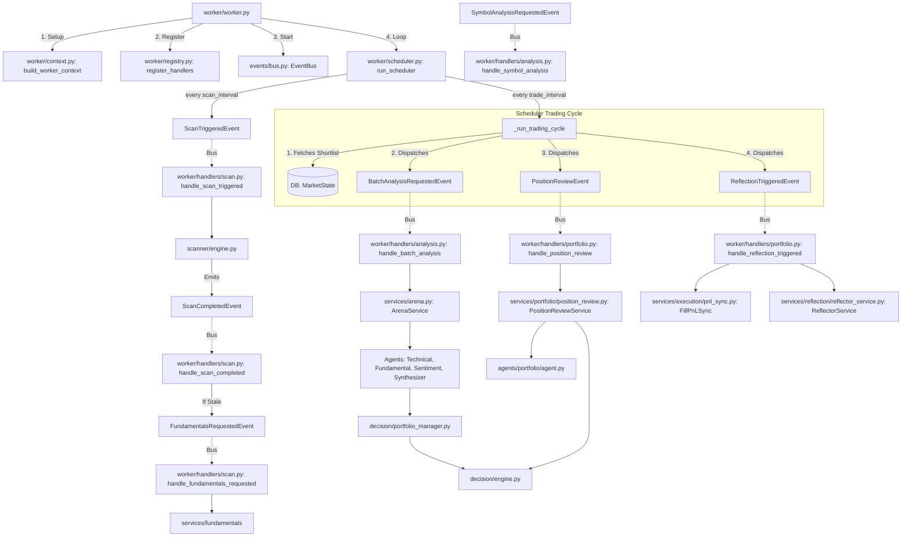

# Agentic Trader: Codebase Architecture & Execution Flow

This document maps out the execution flow of the `agentic-trader` system, starting from the entry point (`worker.py`) and diving deep into every handler, agent layer, decision component, and background service.

## 1. High-Level Flowchart

The system runs on an asynchronous Event-Driven Architecture powered by an in-memory `EventBus`. The `run_scheduler` clock triggers recurring events, which are intercepted by handlers in `worker/registry.py`.

---

## 2. Trading Cycle Deep Dive

The Trading Cycle is the heartbeat of the `agentic-trader`. Executed by `_run_trading_cycle()`, it triggers three parallel but distinct workflows by publishing events.

### Workflow A: Batch Analysis (Arena Mode)
Evaluates the shortlisted candidates and decides where to allocate capital. Orchestrated by `ArenaService`.
- **Data Gathering**: For each symbol, pulls MTF market bars (Daily, 4H) (cached per cycle in `YahooFinanceProvider`), `FundamentalsData`, recent news from Alpaca, and the last 3 LLM lessons from the `LearningJournal`.
- **Sub-Agent Voting**: Local and LLM-powered agents generate individual signals.
- **The "CIO" Synthesis**: `SynthesizerAgent.discuss_batch()` receives all data across all symbols at once. It forces the LLM to competitively rank symbols.
- **Guardrails**: `PortfolioManager` enforces LLM logic rules (e.g., blocking pure-sentiment buys, ensuring valid thesis/invalidation logic). Broker state constraints (cash, open orders) are deferred to the `RiskEngine` and `DecisionEngine`.
- **Execution**: Validated decisions are sent to `DecisionEngine` which calculates risk-adjusted sizing and submits Alpaca order intents.

### Workflow B: Position Review (De-risking)
Monitors active positions and tightens risk parameters or exits early if the thesis breaks.
- **Deterministic Checks**: Before asking the AI, the system triggers automatic `EXIT` if max holding horizons are breached, or `HOLD` if within a minimum holding period.
- **LLM Review**: Passes the symbol, current unrealized PnL %, Daily ATR, and the *original thesis* to the `PortfolioAgent`.
- **Action**: The LLM decides to `HOLD`, `REDUCE`, `TIGHTEN_STOP`, or `EXIT`. The `DecisionEngine` submits market sell intents if an exit is signaled.

### Workflow C: Reflection (Learning Loop)
Reconciles physical broker trades and asks an LLM to reflect on outcomes.
- **PnL Synchronization**: `FillPnLSync` hits Alpaca's fill activities endpoint, aggregates partial fills, upserts `Trade` records, and matches "sells" to open "buys" to close them out.
- **Reflection**: `ReflectorService` scans for newly closed trades and feeds the initial LLM thesis vs the actual outcome to the `ReflectorAgent`.
- **Learning**: The extracted 1-2 sentence lessons are saved to the `LearningJournal` and injected into future `Batch Analysis` prompts.

---

## 3. Agents Layer Deep Dive

The `agents/` directory is the core intelligence layer. It separates strict deterministic computation (base classes, rules-based agents) from stochastic generation (LLM agents).

### Core Base Layer
- **`agent.py` (`BaseAgent`)**: An abstract class defining the thresholding mechanism for rules-based agents. It accepts `buy_threshold`, `sell_threshold`, and an optional `bias`. It exposes a `generate_signal()` template method that applies thresholds and bias to raw score vectors, enforcing a strict logic tree before returning an output.
- **`models.py`**: Defines Pydantic data schemas enforcing structured LLM and deterministic outputs.
  - `AgentResponse`: Represents an individual agent's decision (`signal`, `confidence`, `reasoning`).
  - `AgentVote`: A summarized version used in prompt context arrays.
  - `AggregatedResponse`: An extended `AgentResponse` that includes arrays of sub-agent `votes` and context parameters like `market_snapshot`, `entry_price`, `thesis`, and `expected_horizon_days`.

### Rules-Based "Worker" Agents
These agents execute deterministic math and do not invoke LLMs.
1. **`TechnicalAgent`** (`technical/agent.py`): Scores multi-timeframe inputs (Daily, 4H). Applies a point system to RSI levels, RSI crosses (30/70), moving average trends (MA50), and volume spikes.
2. **`FundamentalsAgent`** (`fundamental/agent.py`): Compares symbol metrics (Revenue growth, P/E ratio, Profit margin, Debt-to-Equity, ROE) against dynamic, static sector baselines (from `services/fundamentals/sector/baselines.py`), scoring positive/negative deviations bounded by maximum ceilings.

### LLM-Powered Agents
These agents use `Groq` and strict `json_object` enforcement to generate insights from contextual text or competitive analysis.
1. **`SentimentAgent`** (`sentiment/agent.py`): Reads a raw array of news headlines and summaries, extracting the underlying tone (Bullish/Bearish/Neutral) and the potential market impact of catalysts to form a basic signal.
2. **`SynthesizerAgent`** (`synthesizer/agent.py`): The "CIO". Processes a massive prompt containing the sub-agent votes, reasons, and past LLM lessons for a *batch* of symbols. Returns an aggregated, competitively-selected `SynthesizerDecision` object. Enforces constraints (Swing trading horizons, mandatory entry/stop/TP brackets).
3. **`PortfolioAgent`** (`portfolio/agent.py`): The "Risk Manager". Sole purpose is de-risking open positions. Receives current PnL, ATR, and the *original thesis*. Instructed explicitly that it may never increase size. Decides between `HOLD`, `TIGHTEN_STOP`, `REDUCE`, or `EXIT`.
4. **`ReflectorAgent`** (`reflector/agent.py`): The "Post-Mortem Analyst". Compares a closed trade's outcome (Positive/Negative PnL) against the original reasoning. Outputs a concise JSON object containing a 1-sentence `lesson` and boolean `is_positive`. (Example output: "Stop loss was too tight during pre-earnings volatility.")

---

## 4. Subsystem Component Reference

- **ScannerEngine (`scanner/engine.py`)**: Responsible for initial shortlisting. Filters out penny stocks and low-volume candidates, then scores the remainder based on RSI and trend mechanics.
- **PortfolioManager (`decision/portfolio_manager.py`)**: A deterministic safety net sitting behind the `SynthesizerAgent`. Forcibly downgrades LLM "BUY" decisions to "HOLD" if AI logic constraints are breached (e.g. attempting to buy without fundamental backing).
- **DecisionEngine (`decision/engine.py`)**: The execution orchestrator. Persists decisions, requests position sizing from the `RiskEngine`, evaluates bracket orders (`BracketPolicy`), and stages pending `OrderIntent` database objects.
- **RiskEngine (`risk/engine.py`)**: Reads the configured `PortfolioPolicy`. Validates available cash reserves, enforces maximum open positions logic, and uses Stop-Loss width (`risk_per_share`) to determine the exact allowed share quantity.
- **AlpacaController (`controller/alpaca_controller.py`)**: The singular external integration point for live broker APIs (Positions, Accounts, Filled Activities, and Limit/Bracket Orders).

---

## 5. API Layer Deep Dive

The `api/` directory implements a REST interface using **FastAPI**, serving as the communication layer for the frontend application (configured via CORS to `localhost:5173`).

- **`app.py`**: The main FastAPI application entry point. It sets up CORS, registers a lifespan context manager (which handles database initialization and logging setup on startup), and includes all API routers.
- **`dependencies.py`**: Houses FastAPI dependency injectors, such as database session provision for routes.
- **`schemas.py`**: Pydantic models for request payload and response validation. Ensures the data traversing the network strictly conforms to the application's types.
- **`routes/`**: Contains logical groupings of API endpoints:
  - **`broker.py`**: Interacts with Alpaca, fetching live account states, positions, and snapshot overviews for the dashboard.
  - **`control.py`**: Exposes application control levers (e.g., triggering manual scans or analysis runs).
  - **`learning.py`**: Exposes the `TradeJournal` records, allowing users to view the AI's past reflections and lessons.
  - **`trading.py`**: Manages the watchlist, market states, and historical trade lists.

---

## 6. Database Layer Deep Dive

The `database/` directory handles persistence using **PostgreSQL** and **SQLAlchemy 2.x** (declarative style).

- **`session.py`**: Manages the connection pool via `create_engine()` and `sessionmaker()`. Exposes the `get_session()` context manager which handles automatic commits and rollbacks upon exceptions.
- **`models.py`**: Defines the Declarative Base classes mapping directly to PostgreSQL tables. Centralizes the state for the entire system:
  - **State Caching**: `MarketState` (persists scan shortlists) and `FundamentalsData` (caches expensive fundamental API calls).
  - **Trade Lifecycle**: `OrderIntent`, `OrderLifecycle`, `PositionMeta`, and `PositionReviewRecord` track the entire lifecycle of a trade—from the LLM's initial thought, to the Alpaca submission, to the ongoing de-risking review. `PositionMeta` notably holds the LLM's initial *thesis* and *invalidation* criteria for the active position, decoupling meta-data from live Alpaca tracking.
  - **Audit & Voting**: `Decision` and `AgentVote` store the exact breakdown of how the Synthesizer and all sub-agents voted on a symbol, capturing the reasoning for future auditing.
  - **Learning**: `Trade` (maps Alpaca fills to local execution) and `TradeJournal` (stores the LLM's extracted lesson after the trade is closed).
- **`repositories/`**: Implements the Data Access Object (DAO) pattern to abstract complex database queries away from the worker handlers.
  - **`broker.py`**: Operations for persisting and querying `BrokerSnapshotRecord`.
  - **`order_intents.py`**: CRUD for managing pending `OrderIntent` objects.
  - **`trades.py`**: Core logic for closing trades, matching incoming sell fills to existing buys, and calculating realized PnL.
  - **`watchlist.py`**: CRUD for `WatchlistEntry`.
  - **`market_state.py`**: Operations for persisting and querying `MarketState` and `FundamentalsData`.
  - **`positions.py`**: Operations for persisting and querying `PositionMeta`.
- **`mapper.py`**: Utilities for mapping JSON payloads or converting external data formats into the structures required by SQLAlchemy models.
